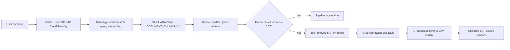

# V2 Final System Validation

## Purpose

This record captures the final deployed state of the V2 SAP BTP Documentation Assistant after completion of development, final held-out evaluation, UI integration, and Cloud Foundry deployment.

The evaluated V2 RAG configuration was frozen before final held-out evaluation under tag `v2-rag-final-dev-freeze`. No prompt, provider, model, retrieval threshold, ranking logic, or generation policy was tuned using the held-out generation results.

## Final Architecture

## Frozen System Configuration

- Retrieval corpus: `DOCUMENT_CHUNKS_V2`
- Corpus size: 138 chunks across 23 processed SAP BTP documents
- Embedding model: `BAAI/bge-small-en-v1.5`
- Embedding dimension: 384
- Retrieval: dense semantic retrieval plus BM25 lexical retrieval combined with reciprocal-rank fusion
- Pipeline abstention threshold: dense rank-1 score `0.75`
- Generation provider: Groq
- Generation model: `openai/gpt-oss-120b`
- Reasoning effort: `medium`
- Sampling: provider defaults; no seed and no explicit temperature in the final frozen configuration
- Grounding policy: use only supplied retrieved SAP documentation evidence
- Citation format: `[DOCxxx](SOURCE_URL)` using the exact retrieved SAP Help URL
- UI runtime: Flask + Gunicorn on SAP BTP Cloud Foundry
- Database access: SAP HANA Cloud through HDI service binding
- Groq credential delivery: Cloud Foundry user-provided service `groq-rag-dev`

## Final Held-Out Evaluation

Canonical raw artifact:

- `data/rag_heldout_final_groq_results_v2.csv`
- Rows: 40
- Supported queries: 24
- Unsupported queries: 16
- SHA-256: `9DE3FABBB9F9CE439A24D45DEB6FF6FB60FA6F282AB4F86C3279664F025A7346`
- Frozen system reference recorded in artifact: `v2-rag-final-dev-freeze`

Mechanical outcome summary:

| Metric | Result |
|---|---:|
| Supported queries generating an answer | 19 / 24 = 79.17% |
| Unsupported queries handled safely by pipeline abstention or LLM refusal | 15 / 16 = 93.75% |
| Unsupported near-domain safe handling | 7 / 8 = 87.50% |
| Unsupported clear out-of-scope safe handling | 8 / 8 = 100% |
| Expected document at hybrid Top-1 | 13 / 24 = 54.17% |
| Expected document within hybrid Top-5 | 22 / 24 = 91.67% |
| Provider errors | 0 / 40 |

Outcome distribution:

- `GENERATED_ANSWER`: 20
- `PIPELINE_ABSTAIN`: 19
- `LLM_REFUSAL`: 1

## Manual Semantic Audit

The raw automatic outcome is not treated as equivalent to semantic answer correctness. A separate manual audit is preserved at:

- `data/rag_heldout_semantic_audit_v2.csv`

Key findings:

1. Five supported questions were false abstentions at the retrieval gate: `HOUT004`, `HOUT005`, `HOUT011`, `HOUT017`, and `HOUT024`.
2. All five were stopped before Groq was called; therefore these are retrieval/threshold coverage failures, not generation failures.
3. `HOUT025` was the primary end-to-end safety failure: a near-domain unsupported SAP Build Process Automation question passed retrieval and received a substantive answer despite the indexed corpus lacking the requested procedural documentation.
4. `HOUT028` demonstrates successful second-stage protection: retrieval accepted an unsupported Cloud Transport Management question, but Groq correctly refused because the supplied evidence was insufficient.
5. `HOUT006` is a material retrieval/generation alignment failure: the expected environment-variable source was absent from Top-5 and the answer shifted toward Destination Service/AppRouter concepts.
6. `HOUT008` demonstrates that exact expected-document retrieval and semantic answer correctness are distinct: the expected source was absent from Top-5, yet semantically equivalent retrieved evidence supported the correct answer.
7. Several otherwise correct generated answers contain bounded, explicitly labeled inference; these are recorded as `PASS_MINOR` rather than silently counted as perfect factual matches.

## Final Interpretation

The final system is best characterized as a conservative RAG assistant with strong protection against clearly unrelated questions and good Top-5 evidence coverage, but a measurable recall trade-off at the fixed retrieval abstention threshold.

The principal weakness is not provider reliability: the final held-out run had zero provider errors. The dominant failure mode is false abstention or evidence-selection weakness near the retrieval boundary. The fixed threshold improves safe rejection of unsupported queries but blocks some answerable questions with dense scores just below `0.75`.

The final report must therefore separate:

- retrieval ranking quality,
- retrieval accept/abstain behavior,
- generation completion,
- semantic answer correctness,
- citation/grounding quality,
- and end-to-end safety.

## UI and Deployment Validation

The final UI was integrated only after the held-out evaluation was complete. UI changes therefore do not alter the reported final V2 experimental results.

Validated live behaviors:

- Flask application deployed successfully to SAP BTP Cloud Foundry.
- HANA diagnostic route remained operational after UI integration.
- Embedding diagnostic route remained operational after UI integration.
- V2 documentation table remained accessible.
- Grounded supported question generated a live answer with extracted SAP source references.
- Clearly unrelated question produced the safe low-confidence/insufficient-documentation state.
- User reviewed the final polished UI and confirmed it looked acceptable; screenshots were intentionally not required for evidence preservation.

## Deployment Issue and Resolution

The first live RAG request failed with:

`GROQ_API_KEY is not configured; no LLM request was made.`

Root cause:

- the deployed Cloud Foundry application had its HANA binding, but no `groq-rag-dev` user-provided service existed in the target space.

Resolution:

1. Created `groq-rag-dev` as a Cloud Foundry user-provided service with credential key `GROQ_API_KEY`.
2. Bound the service to the deployed application.
3. Restaged the application.
4. Re-ran the live question successfully.

This was an infrastructure credential-delivery issue, not a RAG model or retrieval defect. The provider guard correctly prevented an unauthenticated LLM request.

## Evaluation Protocol Deviations / Operational Notes

### Cloud Foundry CLI authentication preflight failure

During final-evaluation setup, the CF CLI authentication token had expired or been revoked. This was detected before any held-out query ran. Re-authentication and environment hydration were completed before the canonical final run.

### Accidental second final-run invocation

After the canonical 40-query held-out run completed, the evaluation command was accidentally started a second time and cancelled with Ctrl+C after several seconds.

The canonical result file remained unchanged:

- row count remained 40
- first query remained `HOUT001`
- last query remained `HOUT040`
- SHA-256 still exactly matched `9DE3FABBB9F9CE439A24D45DEB6FF6FB60FA6F282AB4F86C3279664F025A7346`

Therefore the accidental invocation had no effect on the canonical result artifact or final metrics.

## Final Status

V2 research and implementation state:

- V1 baseline preserved: complete
- V2 corpus and retrieval experiments: complete
- abstention calibration: complete
- generation provider comparison: complete
- citation refinement: complete
- repeatability/sampling experiments: complete
- inference calibration: complete
- frozen final development configuration: complete
- final held-out evaluation: complete
- manual semantic audit: complete
- UI integration: complete
- Cloud Foundry deployment: complete
- live HANA/Groq validation: complete

The remaining work is report synthesis and presentation of evidence, not additional tuning of the frozen V2 system.
