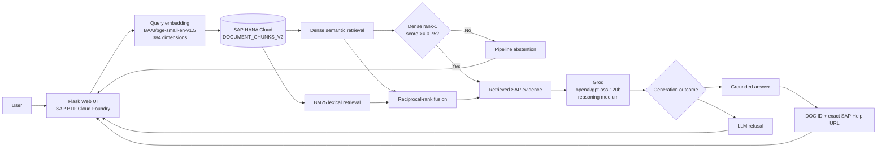
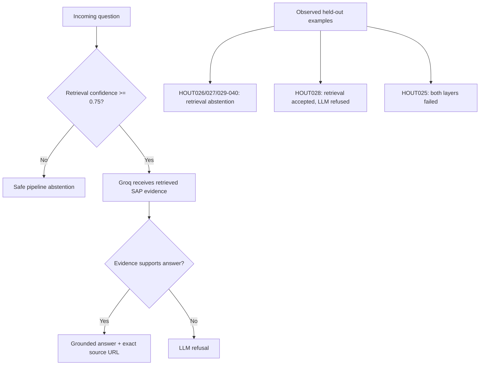
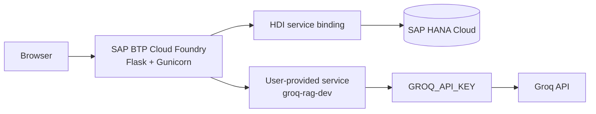

# V2 Report Figure and Chart Plan

## Purpose

This file defines the recommended report figures, tables, and chart data for the V2 SAP BTP Documentation Assistant. It is intentionally separated from the raw experiment artifacts so that figures can be recreated without changing source evidence.

## Figure 1 — Final System Architecture

Caption idea: **End-to-end architecture of the final V2 grounded SAP BTP documentation assistant.**

## Figure 2 — Experimental Methodology and Contamination Control

```mermaid
flowchart LR
    V1[V1 frozen baseline] --> V2[V2 corpus + retrieval variants]
    V2 --> CAL[Development/calibration sets]
    CAL --> RET[Retrieval + abstention calibration]
    RET --> GEN[RAG generation development]
    GEN --> PROV[Gemini vs Groq]
    PROV --> CITE[Citation refinement]
    CITE --> REP[Repeatability + classifier audit]
    REP --> INF[Inference calibration]
    INF --> FREEZE[Final development freeze\nv2-rag-final-dev-freeze]
    FREEZE --> HOUT[40-query held-out final RAG evaluation]
    HOUT --> AUDIT[Separate manual semantic audit]
    AUDIT --> UI[UI integration + deployment]
```

Caption idea: **Evaluation methodology separating development/calibration from the frozen held-out final evaluation.**

## Figure 3 — Original V1 Retrieval Baseline

Chart type: grouped bar chart.

Data:

| Metric | Percent |
|---|---:|
| Top-1 | 66.67 |
| Top-3 | 96.67 |
| Top-5 | 100.00 |

Additional annotation:

- MRR: 0.8083
- n = 30 queries

Important: do not confuse this with the later V2-corpus regression run on the old V1 query set.

## Figure 4 — V1 Baseline vs V2-Corpus Regression on Old Query Set

Chart type: grouped bars.

| Metric | Original V1 baseline | V2 corpus evaluated on old V1 query set |
|---|---:|---:|
| Top-1 | 66.67 | 63.33 |
| Top-3 | 96.67 | 93.33 |
| Top-5 | 100.00 | 96.67 |
| MRR | 0.8083 | 0.7731 |

Purpose: show that expanding/changing the corpus did not automatically improve the legacy query set and motivated controlled V2 retrieval work.

## Figure 5 — Gemini vs Groq Operational Completion

Chart type: two bars.

| Provider | Completed generations | Total | Completion % | Provider errors |
|---|---:|---:|---:|---:|
| Gemini | 13 | 16 | 81.25 | 3 |
| Groq | 16 | 16 | 100.00 | 0 |

Annotation: completion is an operational metric, not factual accuracy.

## Figure 6 — Gemini vs Groq Generation Latency

Chart type: paired mean/median bar chart.

| Provider | Mean ms | Median ms |
|---|---:|---:|
| Gemini | 13094.44 | 12126.95 |
| Groq | 1245.97 | 1295.79 |

Annotation: Groq mean generation latency was approximately 10.51x faster in the 12 paired generated cases.

## Figure 7 — Groq Citation URL Compliance Improvement

Chart type: before/after bars.

| Configuration | Expected URL present among eligible generated supported cases |
|---|---:|
| Groq baseline | 3 / 15 = 20.00% |
| Citation refinement | 14 / 14 = 100.00% |

Purpose: demonstrate the impact of a narrowly scoped prompt intervention without changing retrieval or model.

## Figure 8 — RAGDEV004 Repeatability Across Configurations

Chart type: stacked bars or answer/refusal counts.

| Configuration | Valid generated answers | Refusals | Notes |
|---|---:|---:|---|
| Default sampling, citation-refined | 1 | 4 | automatic classifier originally misclassified two refusals |
| Seed 42 | 4 | 1 | one generated case selected DOC005 instead of expected DOC004 |
| Seed 42 + temperature 0 | 1 | 4 | became more conservative |
| Semantic-support inference calibration | 3 | 2 | generated cases used DOC004 and labeled inference |

Purpose: show that sampling controls did not provide reliable semantic determinism and that prompt semantics mattered more than a lucky seed.

## Figure 9 — Final Held-Out Outcome Distribution

Chart type: horizontal bars or donut.

| Outcome | Count | Percent |
|---|---:|---:|
| GENERATED_ANSWER | 20 | 50.00 |
| PIPELINE_ABSTAIN | 19 | 47.50 |
| LLM_REFUSAL | 1 | 2.50 |

n = 40.

## Figure 10 — Final Supported vs Unsupported End-to-End Behavior

Chart type: grouped stacked bars.

### Supported (n=24)

- Generated answer: 19
- Pipeline abstention: 5
- LLM refusal: 0

### Unsupported (n=16)

- Generated answer: 1
- Pipeline abstention: 14
- LLM refusal: 1

This is the clearest high-level end-to-end safety/coverage chart.

## Figure 11 — Unsupported Safety by Difficulty

Chart type: two bars.

| Unsupported category | Safe handling | Total | Rate |
|---|---:|---:|---:|
| Near-domain SAP questions | 7 | 8 | 87.50% |
| Clear out-of-scope questions | 8 | 8 | 100.00% |

Purpose: demonstrate that the difficult failure boundary is semantically adjacent SAP content, not obviously unrelated user queries.

## Figure 12 — Final Expected-Document Retrieval

Chart type: Top-1 vs Top-5 bars.

| Retrieval metric | Correct | Total | Rate |
|---|---:|---:|---:|
| Expected document Top-1 | 13 | 24 | 54.17% |
| Expected document Top-5 | 22 | 24 | 91.67% |

Interpretation: candidate evidence coverage is high at Top-5, but ordering and the separate dense-score abstention gate remain important failure sources.

## Figure 13 — Final Failure Decomposition

Suggested chart: categorical bar chart.

| Failure / recovery type | Count | Query IDs |
|---|---:|---|
| Supported false abstention at retrieval gate | 5 | HOUT004, HOUT005, HOUT011, HOUT017, HOUT024 |
| Unsafe unsupported generated answer | 1 | HOUT025 |
| Unsupported retrieval false accept recovered by LLM refusal | 1 | HOUT028 |
| Material supported retrieval/generation alignment failure | 1 | HOUT006 |

Purpose: emphasize that the largest issue is conservative retrieval gating rather than provider outages.

## Figure 14 — Semantic Audit of Supported Questions

Suggested chart: stacked bar of 24 supported cases.

Manual semantic audit counts:

| Semantic class | Count |
|---|---:|
| PASS | 11 |
| PASS_MINOR | 6 |
| PARTIAL_GROUNDING_ISSUE | 1 |
| MATERIAL_FAILURE | 1 |
| FALSE_ABSTENTION | 5 |

Derived conservative interpretation:

- Clearly acceptable (`PASS` + `PASS_MINOR`): 17 / 24 = 70.83%
- Partial grounding issue: 1 / 24 = 4.17%
- Material generated-answer failure: 1 / 24 = 4.17%
- False abstention: 5 / 24 = 20.83%

This figure must be labeled as **manual qualitative audit**, not an automatic benchmark metric.

## Figure 15 — Safety Layers

Purpose: explain the defense-in-depth design and exactly where HOUT025 escaped both controls.

## Figure 16 — Deployment Architecture

Deployment note: the first live generation attempt failed safely because `groq-rag-dev` was absent. Creating the user-provided service, binding it, and restaging resolved credential delivery without changing RAG logic.

## Recommended Tables

### Table A — Experimental timeline

Columns:

`Stage | Purpose | Configuration change | Dataset | Result | Decision`

Use the entries from `docs/report_evidence_ledger_v2.md`.

### Table B — Final held-out confusion-style summary

| Ground truth | Answered | Pipeline abstain | LLM refuse |
|---|---:|---:|---:|
| Supported (24) | 19 | 5 | 0 |
| Unsupported (16) | 1 | 14 | 1 |

### Table C — Selected failure cases

Recommended rows:

- HOUT004 — false abstention, expected DOC004, dense score 0.7139
- HOUT005 — false abstention, expected DOC005, dense score 0.7428
- HOUT006 — generated but wrong concept/source direction
- HOUT011 — false abstention, dense score 0.7352
- HOUT017 — false abstention, dense score 0.7311
- HOUT024 — false abstention, dense score 0.7356
- HOUT025 — unsafe near-domain answer
- HOUT028 — successful LLM refusal after retrieval false accept

## Visual Narrative Recommendation

The report should visually tell this sequence:

1. V1 worked reasonably well but left retrieval improvement space.
2. V2 expanded the corpus and introduced systematic retrieval experimentation.
3. Safety required a calibrated abstention mechanism.
4. Provider experiments favored Groq operationally.
5. Citation refinement dramatically improved traceability.
6. Repeatability experiments revealed stochastic behavior and an evaluator bug.
7. Semantic-support calibration improved the difficult borderline case without tuning on final held-out data.
8. The frozen final evaluation showed strong unsupported-query safety but conservative supported-query recall.
9. Manual audit showed why generated-answer count alone is not sufficient.
10. The final system was integrated and deployed on SAP BTP with HANA Cloud and a bound external LLM credential service.
